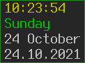

## About

My configuration for [StumpWM](https://github.com/stumpwm/stumpwm).  I
separate my settings into several files instead of using a single
`.stumpwmrc`.

All symbols (commands, functions, macros, variables) in my config have
`al/` prefix to make sure they will not conflict with symbols from
`:stumpwm` module.

My mode line (customized with `*screen-mode-line-format*` variable):

My time message (`time` command customized with
`*time-format-string-default*` variable):

## Files

- `init.lisp` – The main file for loading the other ones (`~/.stumpwmrc` is a
  symlink to this file).

- `keys.lisp` – All my keybindings (I use dvorak layout, so some of them
  may look weird).

- `xkb.lisp` – Configuration for [clx-xkeyboard
  extension](https://github.com/filonenko-mikhail/clx-xkeyboard).  I use
  it to switch keyboard layout and to get/set the state of CapsLock and
  NumLock keys.

- `sound.lisp` – An interface for setting sound volume and showing it in
  OSD.  I use [Guile-Daemon](https://github.com/alezost/guile-daemon) and
  [Guile-XOSD](https://github.com/alezost/guile-xosd) to do this.  See
  [my Guile-Daemon config](https://github.com/alezost/guile-daemon-config)
  for details.

- `utils.lisp` – Additional functions and commands I use.

- `settings.lisp` – General stumpwm settings.

- `visual.lisp` – Visual settings: colors, mode-line and other visual
  appearance.  This file loads the following `mode-line-` files that
  provide additional features for my stumpwm mode line.

- `mode-line-cpu.lisp` and `mode-line-thermal.lisp` – modules to get CPU
  usage and temperature.  I use these files instead of
  [cpu](https://github.com/stumpwm/stumpwm-contrib/blob/master/modeline/cpu)
  contributed stumpwm module.

- `mode-line-battery.lisp` – module to get battery info.  I use it instead of
  [battery-portable](https://github.com/stumpwm/stumpwm-contrib/blob/master/modeline/battery-portable)
  contributed stumpwm module.

- `mode-line-net.lisp` – module to get battery info.  I use it instead of
  [net](https://github.com/stumpwm/stumpwm-contrib/blob/master/modeline/net)
  contributed stumpwm module.

- `ttf.lisp` – Setting TTF font using
  [ttf-fonts](https://github.com/stumpwm/stumpwm-contrib/blob/master/util/ttf-fonts)
  contributed stumpwm module.

- `unused` directory contains some old and unused code.

## Feedback

I am not an expert in Lisp, I just like StumpWM a lot, so if you find
errors or if you see that something can be implemented better, you may
send me a message about that.
