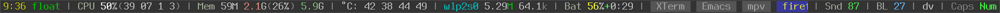

## About

My configuration for [StumpWM](https://github.com/stumpwm/stumpwm).  I
separate my settings into several files instead of using a single
`.stumpwmrc`.

All symbols (commands, functions, macros, variables) in my config have
`al/` prefix to make sure they will not conflict with symbols from
`:stumpwm` module.

My mode line is clickable almost everywhere.  Here is the difference
between my default mode line and after clicking on some of its parts:

## Files

- `al-stumpwm-config.asd`: File providing ASDF system.  Used by
  `init.lisp` to load the rest config files.

- `init.lisp`: The main file for loading the rest config files
  (`~/.stumpwmrc` is a symlink to this file).

- `keys.lisp`: All my keybindings (I use dvorak layout, so some of them
  may look weird).

- `xkb.lisp`: Configuration for [clx-xkeyboard
  extension](https://github.com/filonenko-mikhail/clx-xkeyboard).  I use
  it to switch keyboard layout and to get/set the state of CapsLock and
  NumLock keys.

- `sound.lisp`: An interface for setting sound volume and showing it in
  OSD.  I use [Guile-Daemon](https://github.com/alezost/guile-daemon) and
  [Guile-XOSD](https://github.com/alezost/guile-xosd) to do this.  See
  [my Guile-Daemon config](https://github.com/alezost/guile-daemon-config)
  for details.

- `utils.lisp`: Additional functions and commands used by the rest config.

- `settings.lisp`: General stumpwm settings.

- `ml-*.lisp`: Modules to get various info for the mode line.  I use
  these files instead of
  [contrib](https://github.com/stumpwm/stumpwm-contrib/blob/master/modeline/)
  stumpwm modules.

- `visual.lisp`: Visual settings: colors, mode-line and other visual
  appearance.

- `unused` directory contains some old and unused code.

## Feedback

I am not an expert in Lisp, I just like StumpWM a lot, so if you find
errors or if you see that something can be implemented better, you may
send me a message about that.
